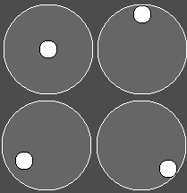

# Godot-Virtual-Joystick
A simple, highly customizable, virtual joystick for Android and IOS on the Godot Game Engine that supports multitouch

# Install
Create a Control Node and add this script onto it

# Use
get_value - returns the value of the virtual joystick, a vector2 ranging from -1,-1 to 1,1

is_active - returns whether or not the virtual joystick is receiving input.

## MISC
Persistent - If persistent is set to true then the virtual joystick will always be visable, If it is set to false then the virtual joystick will appear whenever a spot inside of the control node is clicked and will originate from the spot clicked.

Start Pos - If persistent then start pos is the initial position of the virtual joystick

Mouse Trigger - Defaults to left mouse button, determines what mouse button is used to control the virtual joystick, useful for debuging

## BACKGROUND
Background Color - What color the background circle will be

Background Stroke Width - The width of the background circles stroke

Background Stroke Color - The color of the background circles stroke

Background Radius - The radius of the background circle

Background Resolution - The number of points used to approximate the background circle

## Foreground
Foreground Color - What color the foreground circle will be

Foreground Stroke Width - The width of the foreground circles stroke

Foreground Stroke Color - The color of the foreground circles stroke

Foreground Radius - The radius of the foreground circle

Foreground Resolution - The number of points used to approximate the foreground circle
